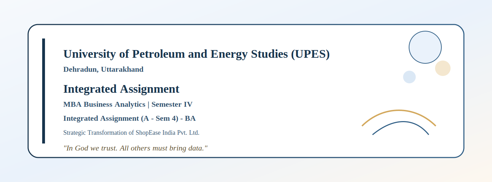
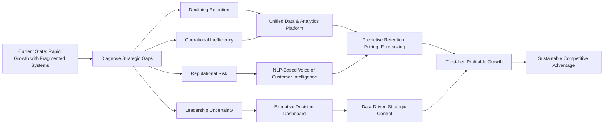
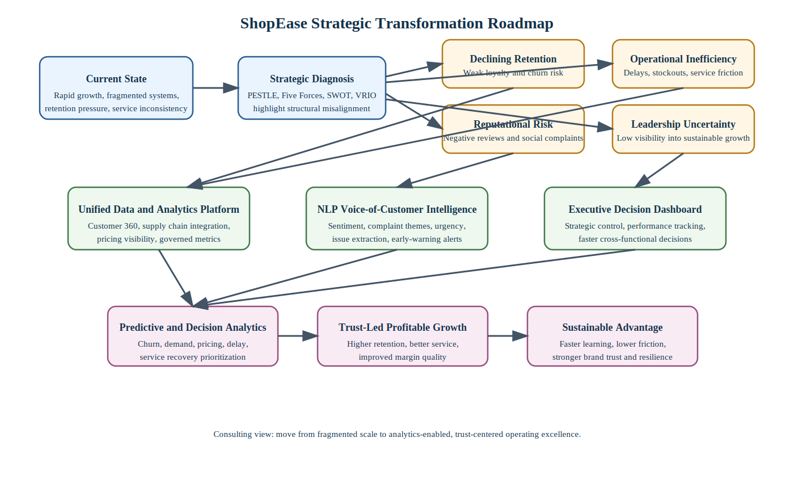
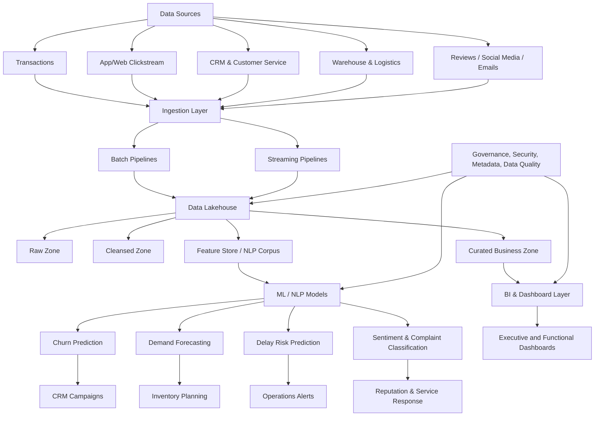
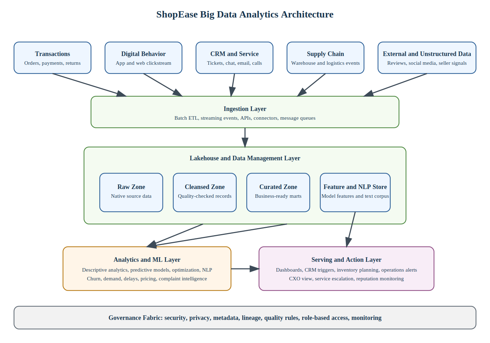
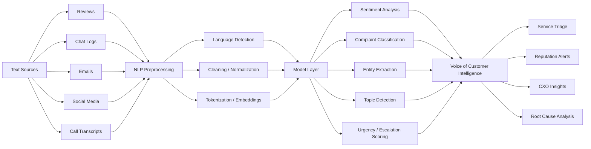
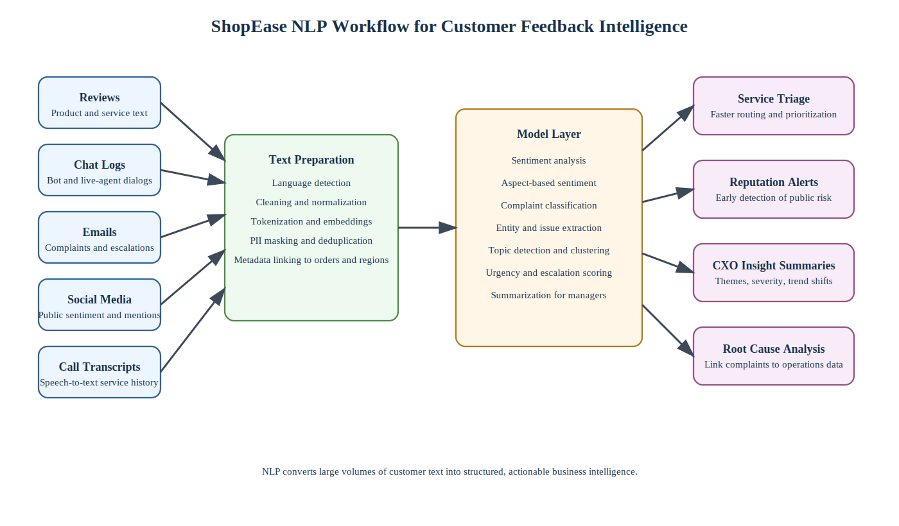
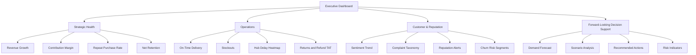
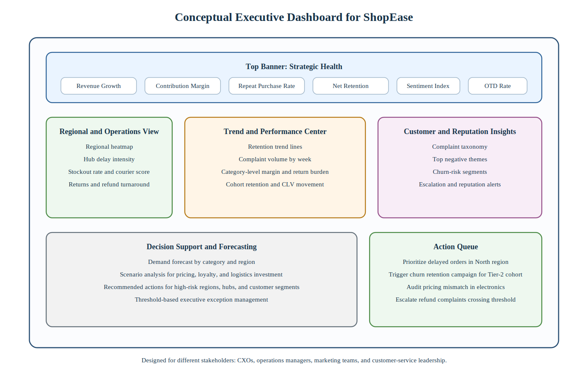

# University of Petroleum and Energy Studies (UPES)
## Dehradun, Uttarakhand

## MBA Business Analytics Semester IV
## Integrated Assignment
### Integrated Assignment (A - Sem 4) - BA
### Strategic Transformation of ShopEase India Pvt. Ltd.

---

| Submission Detail | Information |
|---|---|
| Name | MUSTKEEM AHMAD |
| SAP ID | 500129078 |
| UPES Email ID | Mustkeem.129078@stu.upes.ac.in |
| Alternate Email ID | mustkeem324@gmail.com |
| Program | MBA Business Analytics |
| Semester | Semester IV |
| Course / Assignment | Integrated Assignment (A - Sem 4) - BA |
| University | UPES, Dehradun |
| Submission Date | 18 May 2026 |

---

> "In God we trust. All others must bring data." - W. Edwards Deming

---

## Introduction

This integrated assignment presents a strategic, analytical, and decision-oriented evaluation of ShopEase India Pvt. Ltd., a rapidly growing omni-channel retail company operating in a highly competitive digital environment. The purpose of this report is to apply concepts from strategic management, big data analytics, natural language processing, and data visualization in an integrated manner to diagnose the firm's challenges and recommend a practical transformation roadmap.

The report is designed from the perspective of a business analytics consulting team advising senior leadership. Accordingly, the discussion does not treat strategy, operations, customer feedback, and executive reporting as separate topics. Instead, it shows how competitive pressure, internal process inefficiency, fragmented data systems, and reputational risk are interconnected and how analytics can be used as a source of both operational improvement and sustainable competitive advantage.

---

## Table of Contents

| Section No. | Section Title | Focus Area |
|---|---|---|
| 1 | Executive Summary | Overall business problem, strategic direction, and integrated recommendations |
| 2 | Q1. Comprehensive Strategic Analysis | External environment, competition, internal misalignment, and sustainable advantage |
| 3 | Q2. Big Data Analytics for ShopEase | Data types, analytics lifecycle, architecture, and use cases |
| 4 | Q3. NLP for Customer Feedback Intelligence | Sentiment analysis, text classification, extraction, and reputation management |
| 5 | Q4. Conceptual Executive Dashboard | Dashboard design, stakeholder views, visualization logic, and decision support |
| 6 | Integrated Recommendations | Consolidated action agenda for transformation |
| 7 | Implementation Governance and Change Roadmap | Governance model, KPI ownership, execution risks, and change management |
| 8 | Explicit Course Integration | How strategic management, big data, NLP, and visualization are integrated |
| 9 | References | Academic and professional sources used in the assignment |

---

## Executive Summary

ShopEase India Pvt. Ltd. is a high-growth omni-channel retailer operating in fashion, electronics, and home essentials. The company has scaled to more than 15 million registered customers and approximately 200,000 transactions per day, which indicates strong market traction and digital adoption. However, scale has exposed structural weaknesses. The firm faces intense rivalry from global e-commerce platforms, regional price-led competitors, and niche digital-first brands. At the same time, customer retention is weakening, especially in Tier-2 and Tier-3 markets, where service reliability, trust, affordability, and localized engagement matter more than aggressive top-line growth alone. Internally, fragmented data systems across supply chain, marketing, and customer service prevent a unified view of performance and customer behavior. Externally visible service failures are generating negative reviews, eroding brand trust, and increasing reputational risk.

The central strategic problem is therefore not lack of growth, but **misaligned growth**. ShopEase has expanded faster than its organizational integration, service capability, and analytics maturity. This creates a gap between customer promise and delivery experience. The company's next phase should be based on **data-driven profitable growth**, not simply geographic or category expansion. A sustainable strategic direction for ShopEase requires four interlinked shifts:

1. From transaction growth to customer lifetime value growth.
2. From siloed functions to an integrated data and decision platform.
3. From reactive service recovery to predictive service assurance.
4. From price-led competition to trust-led differentiated retailing.

From a strategic perspective, the company should reposition itself around customer trust, reliability, localized relevance, and analytics-enabled operating excellence. This means using analytics not as a reporting function but as a source of strategic advantage. A well-designed analytics capability can help ShopEase predict churn, personalize offers, optimize inventory, improve pricing consistency, reduce delivery failures, detect emerging reputational threats, and support leadership decisions under uncertainty.

The recommended roadmap integrates strategic management, big data analytics, natural language processing, and executive visualization. First, external and internal analysis suggests that competition will remain severe, switching costs are low, and customer expectations will continue to rise. Therefore, ShopEase must compete through superior execution and superior learning, not only assortment or discounting. Second, the company should build a modern data architecture combining data lakehouse storage, streaming ingestion, governed master data, a feature store for machine learning, and self-service business intelligence. Third, customer text from reviews, chat logs, call transcripts, emails, and social media should be treated as a strategic asset and analyzed using multilingual NLP techniques such as sentiment analysis, issue classification, urgency scoring, and entity extraction. Finally, these insights should be integrated into an executive dashboard tailored to CXOs, operations managers, and marketing teams so that decisions are made quickly, visibly, and with accountability.

In essence, ShopEase can create sustainable competitive advantage if it turns data into faster learning, learning into better decisions, and better decisions into a consistently better customer experience. The company's long-term success will depend not on how much data it possesses, but on how effectively it converts that data into trust, efficiency, resilience, and profitable customer relationships.

---

# Q1. Comprehensive Strategic Analysis of ShopEase India Pvt. Ltd.

## 1.1 Introduction to the Strategic Context

ShopEase operates in a dynamic omni-channel retail environment shaped by digital acceleration, changing consumer behavior, mobile-first commerce, social influence, and expectations of near-real-time service. Its scale suggests that the business model has been commercially attractive, but its recent challenges indicate that strategy execution has not matured at the same pace as expansion. This is common in fast-scaling platform-oriented businesses. Early growth often depends on customer acquisition, promotions, category expansion, and logistics rollout. Later-stage success, however, depends on integration, trust, retention, analytics maturity, and governance discipline.

The core strategic question for ShopEase is therefore: **How can the company sustain growth while improving competitiveness, customer retention, and operational resilience in a data-driven economy?**

To answer this, the organization must be examined through multiple strategic lenses:

- Macro-environmental forces affecting retail and digital commerce.
- Industry-level competitive forces shaping profitability.
- Internal strategic misalignments across corporate and business levels.
- The role of analytics capabilities as an enduring source of advantage.

---

## 1.2 External Environment Analysis

### 1.2.1 PESTLE Analysis

#### Political Factors

India's policy environment increasingly affects digital commerce through evolving rules on e-commerce conduct, consumer protection, data governance, taxation, logistics, and digital infrastructure. Government support for digital payments, UPI expansion, and public digital infrastructure benefits retailers such as ShopEase by increasing online transaction convenience and reducing friction in adoption across semi-urban and rural markets. However, policy scrutiny on marketplace behavior, pricing transparency, foreign competition, and consumer rights increases compliance expectations. Any lack of price consistency or unresolved service complaints can quickly escalate into both regulatory and reputational issues.

#### Economic Factors

ShopEase benefits from rising consumption, growing smartphone penetration, and increasing demand from aspirational households. However, Indian consumers remain price-sensitive, especially in Tier-2 and Tier-3 cities. Inflationary pressures, fuel costs, supply chain costs, and changing discretionary spending patterns directly influence margin structure and demand stability. Economic uncertainty also shifts customer behavior toward value-seeking, comparison shopping, and delayed repeat purchases. This reduces retention if the platform does not offer consistent experience and relevant value.

#### Social Factors

Consumers increasingly expect convenience, speed, personalization, affordability, trust, and responsive after-sales support. Social validation strongly shapes purchase decisions. Ratings, influencer opinions, peer reviews, and viral complaints can rapidly alter brand perception. In Tier-2 and Tier-3 markets, trust deficits are more damaging because customers may be first-generation e-commerce adopters or less forgiving of failed deliveries and poor support. Social diversity in India also implies linguistic diversity, cultural variation, and regional preference patterns, which generic national strategies often fail to capture.

#### Technological Factors

The retail sector is being reshaped by AI-driven personalization, demand forecasting, dynamic pricing, recommendation systems, warehouse automation, last-mile analytics, and conversational support. Cloud infrastructure, data engineering, and machine learning now influence competitive performance. Firms that unify and operationalize data gain speed and precision in decision-making. ShopEase's fragmented systems therefore represent not only an operational weakness but a strategic handicap.

#### Legal Factors

Consumer data privacy, grievance redressal, return/refund standards, pricing disclosures, cybersecurity expectations, and platform accountability all create legal obligations. ShopEase's negative reviews relating to delayed delivery and inconsistent pricing raise risks beyond customer dissatisfaction. If repeated patterns suggest unfairness or lack of disclosure, legal and compliance exposure increases.

#### Environmental Factors

Sustainability considerations in packaging, logistics efficiency, reverse logistics, and carbon footprint are increasingly relevant. While not yet the primary basis of competition for all retail consumers, sustainability affects brand positioning, operational cost control, and investor confidence. Efficient routing, reduced failed deliveries, better inventory planning, and lower returns can create both financial and environmental benefits.

### 1.2.2 Implications of PESTLE for ShopEase

The macro-environment suggests three conclusions:

1. Growth opportunities remain large, especially outside metro markets.
2. Operational reliability and trust are becoming as important as price and assortment.
3. Data capability is increasingly essential for competitiveness, compliance, and service quality.

This means ShopEase cannot rely on expansion logic alone. It must professionalize its data architecture, decision systems, and customer experience management.

---

## 1.3 Industry and Competitive Analysis

### 1.3.1 Porter's Five Forces (Porter, 2008)

#### 1. Rivalry Among Existing Competitors: Very High

Competition in Indian retail e-commerce is intense due to:

- Large global platforms with deep capital and advanced analytics.
- Strong domestic marketplaces and specialized vertical brands.
- Low product differentiation in many categories.
- High price transparency and comparison behavior.
- Frequent promotions and discounting.

As a result, customer switching costs are low, retention is difficult, and margins are under pressure. Operational failures accelerate switching because customers can easily move to alternatives.

#### 2. Threat of New Entrants: Moderate

Entering e-commerce at small scale is feasible due to digital storefront tools, social commerce, and third-party logistics providers. However, scaling profitably across categories and geographies is difficult. Brand trust, data assets, fulfillment capability, and vendor ecosystem depth create entry barriers. ShopEase is vulnerable less to generic entrants and more to focused niche brands that win through superior experience in selected categories.

#### 3. Bargaining Power of Buyers: Very High

Customers can compare prices, delivery promises, reviews, and return policies instantly. Their bargaining power is amplified by platform transparency and social media voice. They may not negotiate directly, but they exercise power through switching, review behavior, cart abandonment, and lifetime value erosion. This makes customer analytics, experience consistency, and retention systems strategically critical.

#### 4. Bargaining Power of Suppliers: Moderate to High

In categories such as electronics and branded fashion, supplier power can be significant because brand owners control assortment, pricing flexibility, and availability. If ShopEase lacks differentiated proprietary labels or strong supplier partnerships, it may have limited room to protect margins. On the logistics side, dependence on outsourced partners also creates service variability.

#### 5. Threat of Substitutes: High

Substitutes include:

- Offline retail chains and local stores.
- Brand-owned direct-to-consumer websites.
- Social commerce and influencer commerce.
- Quick commerce platforms for selected categories.

This expands competitive pressure beyond conventional marketplaces and makes experience-based differentiation more urgent.

### 1.3.2 Strategic Takeaway from Five Forces

The industry structure suggests that long-term profitability will not come from scale alone. To survive and outperform, ShopEase must build capabilities that competitors cannot easily replicate. These include:

- A unified view of customer and operations data.
- More reliable and predictive supply chain execution.
- Localized customer engagement.
- Faster detection and correction of service failures.
- Better management of reputation and trust signals.

---

## 1.4 Internal Strategic Analysis

### 1.4.1 Symptoms Visible in the Case

The case signals four internal weaknesses:

1. Declining customer retention.
2. Fragmented data systems.
3. Service inconsistency and negative reviews.
4. Leadership uncertainty about strategic sustainability.

These are not isolated issues. They reflect a deeper problem of **misalignment between growth strategy, operating model, and analytics capability**.

### 1.4.2 Corporate-Level Strategic Misalignments

At the corporate level, ShopEase appears to have pursued aggressive expansion across channels, categories, and logistics nodes without establishing a strong integrative backbone. Corporate strategy should define where to play and how to create value across the portfolio. In ShopEase's case, expansion may have created complexity faster than the organization's systems and governance could absorb.

Likely corporate-level misalignments include:

- **Growth bias over capability maturity:** New customers, categories, and hubs were prioritized more than data integration, service quality, and retention economics.
- **Scale without coordination:** Different business functions hold different fragments of the customer journey, reducing enterprise-level visibility.
- **Inadequate portfolio discipline:** Fashion, electronics, and home essentials have different demand patterns, margin structures, return rates, and service requirements. A uniform operating approach may be suboptimal.
- **Weak strategic control systems:** Leadership concerns about sustainability imply insufficient visibility into the real drivers of profitable growth.

### 1.4.3 Business-Level Strategic Misalignments

At the business level, ShopEase's market strategy seems insufficiently aligned with its value proposition. If the company competes on convenience, assortment, and pricing, then inconsistent delivery, poor after-sales service, and pricing variability directly undermine customer trust. This creates a strategic contradiction: the brand promise attracts demand, but the operating experience weakens loyalty.

Specific business-level issues likely include:

- **Overemphasis on acquisition over retention:** Resources may have been optimized for gross order growth rather than customer lifetime value.
- **Weak localized differentiation:** Tier-2 and Tier-3 consumers may need regional language engagement, more reliable support, and higher trust assurance.
- **Reactive customer service:** Complaints are being noticed through public channels, indicating that the organization is hearing customers too late.
- **Disconnected pricing logic:** Inconsistent pricing erodes perceived fairness and platform credibility.
- **Limited service recovery intelligence:** The absence of integrated analytics prevents early intervention when delivery delays or post-purchase failures begin.

---

## 1.5 Strategic Diagnosis Using SWOT

| Dimension | Analysis |
|---|---|
| Strengths | Large customer base, omni-channel presence, digital expansion, regional logistics footprint, rich data generation, multi-category reach |
| Weaknesses | Data fragmentation, declining retention, inconsistent service quality, pricing inconsistency, weak integration across functions |
| Opportunities | Tier-2 and Tier-3 growth, AI-driven personalization, demand forecasting, NLP-based voice of customer analysis, loyalty redesign, private labels, sustainable logistics |
| Threats | Intense competition, low switching costs, public reputational damage, margin pressure, regulatory scrutiny, fast-changing customer expectations |

### SWOT Interpretation

ShopEase's greatest unrealized asset is not its infrastructure or current scale alone, but the data embedded in its transactions, service interactions, and customer feedback. However, unless this asset is governed, integrated, and activated, it remains a passive by-product rather than a strategic resource.

---

## 1.6 Strategic Direction for Growth, Competitiveness, and Sustainability

### 1.6.1 Proposed Strategic Position

ShopEase should adopt the following strategic direction:

**"Become India's most trusted analytics-driven omni-channel retailer for value-conscious emerging-market consumers by combining reliable fulfillment, personalized engagement, and integrated decision intelligence."**

This direction balances three goals:

- **Growth:** Continue expansion in promising markets and categories.
- **Competitiveness:** Differentiate through trust, service consistency, and smarter decisions.
- **Sustainability:** Improve economics through efficiency, better retention, and reduced service waste.

### 1.6.2 Strategic Pillars

#### Pillar 1: Trust-Led Customer Strategy

Trust should become a strategic metric rather than a branding slogan. This requires:

- Consistent pricing rules across channels.
- Predictable delivery performance.
- Proactive communication on delays.
- Faster complaint resolution.
- Transparent returns and refunds.
- Better after-sales support.

#### Pillar 2: Customer Lifetime Value Over Gross Transactions

Rather than maximizing transaction count alone, ShopEase should optimize for repeat purchase behavior, contribution margin, and segment-wise lifetime value. This shift would improve capital discipline and reduce dependency on discount-led acquisition.

#### Pillar 3: Unified Data and Analytics Platform

All critical functions, including marketing, inventory, logistics, pricing, and customer service, should feed into a common analytics ecosystem. This is the enabler of enterprise-wide visibility and coordinated decision-making.

#### Pillar 4: Tier-2 and Tier-3 Market Localization

Retention decline in these markets signals a mismatch between current operating design and local needs. ShopEase should invest in:

- Regional language interfaces and service support.
- Region-specific assortment and promotions.
- Service reliability monitoring by pin code.
- Trust-building delivery communication.

#### Pillar 5: Sustainable Operations and Margin Quality

Sustainability in this case means both environmental and economic sustainability. Better routing, fewer failed deliveries, lower return rates, improved forecast accuracy, and better inventory placement all reduce cost and carbon simultaneously.

---

## 1.7 How Analytics Can Become a Source of Sustainable Competitive Advantage

Analytics becomes a source of competitive advantage only when it is embedded in routines, decisions, and customer experience in ways that are difficult to replicate. Merely purchasing software or hiring data scientists is not enough.

### 1.7.1 VRIO Perspective (Barney, 1991)

Analytics capabilities can be evaluated using the VRIO framework:

- **Valuable:** Analytics can reduce churn, improve service reliability, optimize pricing, and strengthen decision-making.
- **Rare:** Advanced analytics alone may not be rare, but analytics integrated with proprietary customer data, regional insights, and operational execution can be rare.
- **Inimitable:** Competitors may imitate tools, but not easily replicate ShopEase's unique history of transactions, complaints, service patterns, and market-specific behavior if these are well-organized.
- **Organized:** Sustainable advantage depends on whether ShopEase has the governance, talent, systems, and leadership commitment to use analytics systematically.

### 1.7.2 Why Analytics Can Be Durable for ShopEase

Analytics can create durable advantage for ShopEase in at least five ways:

#### 1. Data Network Effects

More transactions generate more data. More data improves recommendations, forecasting, service prioritization, and fraud detection. Better outcomes improve customer experience, which can generate more transactions. This feedback loop creates compounding advantage if managed properly.

#### 2. Faster Organizational Learning

An analytics-driven firm learns earlier which customers are likely to churn, which routes are failing, which products create dissatisfaction, and which interventions work. Strategic advantage increasingly comes from **rate of learning**, not just possession of resources.

#### 3. Better Resource Allocation

Analytics allows smarter allocation of marketing spend, inventory, delivery capacity, and service resources. In a low-margin environment, better decisions about where to invest and where to stop investing become crucial.

#### 4. Personalized Value Creation

Personalization increases relevance, conversion, and loyalty. If ShopEase can personalize offers, bundles, service interventions, and loyalty benefits in ways aligned with customer context, it can increase switching costs indirectly.

#### 5. Reputation Protection and Recovery

NLP-based monitoring of reviews and social media allows rapid detection of reputational issues before they escalate. A company that prevents trust erosion is strategically stronger than one that only reacts after public damage has occurred.

### 1.7.3 Conditions for Success

For analytics to become a real strategic asset, ShopEase must:

- Integrate data across functions.
- Define decision rights clearly.
- Invest in data quality and governance.
- Create cross-functional analytics squads.
- Link models to action workflows.
- Build trust in dashboards and metrics.
- Train managers to use analytics for decisions, not just reporting.

---

## 1.8 Strategic Roadmap

**Image version for Word/PDF use:**  

### 1.8.1 Phase-Wise Strategic Roadmap

| Phase | Time Horizon | Focus | Key Outputs |
|---|---|---|---|
| Phase 1 | 0-6 months | Stabilize trust and visibility | Unified KPI definitions, pricing audit, delivery issue heatmaps, complaint taxonomy, dashboard MVP |
| Phase 2 | 6-12 months | Build analytics backbone | Lakehouse, master data management, churn model, forecast model, service-risk alerts |
| Phase 3 | 12-18 months | Operationalize intelligence | Personalization engine, route optimization, workforce prioritization, loyalty redesign |
| Phase 4 | 18-24 months | Scale and refine | Closed-loop experimentation, scenario planning, margin optimization, sustainability metrics |

---

## 1.9 Conclusion to Q1

The strategic analysis shows that ShopEase's problem is not lack of market potential, but a widening gap between expansion and execution capability. External conditions will continue to reward firms that are trusted, agile, analytics-driven, and operationally disciplined. Internally, ShopEase must correct misalignments between growth strategy, business model, service operations, and data systems. A data-driven strategy centered on trust, customer lifetime value, localized relevance, and integrated analytics can enable the company to move from vulnerable growth to sustainable advantage.

---

# Q2. Big Data Analytics for ShopEase

## 2.1 Nature of Data Relevant to ShopEase

ShopEase generates large volumes of heterogeneous data across digital channels, supply chain processes, and customer interactions. To solve its challenges, the company must first classify the data by structure and business use.

### 2.1.1 Structured Data

Structured data is highly organized and usually stored in relational systems. For ShopEase, relevant structured data includes:

- Customer master records.
- Order transaction logs.
- SKU-level product catalogs.
- Inventory levels by warehouse and hub.
- Delivery timestamps and fulfillment events.
- Returns and refund records.
- Payment transaction details.
- Campaign response data.
- Pricing tables and discount records.
- Supplier performance metrics.

Structured data is critical for reporting, forecasting, and optimization. It supports descriptive dashboards, predictive models, and decision analytics.

### 2.1.2 Semi-Structured Data

Semi-structured data includes data that does not conform fully to tabular schemas but contains tags, keys, or metadata. Relevant examples for ShopEase include:

- App clickstream data in JSON format.
- Web browsing logs.
- Email headers and support metadata.
- CRM event logs.
- API response payloads.
- IoT or delivery scan event messages.
- Marketing automation events.

Semi-structured data is especially useful for journey mapping, funnel analysis, event sequencing, and near-real-time alerts.

### 2.1.3 Unstructured Data

Unstructured data is one of ShopEase's most underutilized resources. It includes:

- Product reviews.
- Customer support chat transcripts.
- Emails and complaint narratives.
- Social media comments and posts.
- Call center transcripts.
- Agent notes.
- Image or video-based complaint evidence.

Unstructured data is essential for identifying dissatisfaction drivers, emerging reputational risks, service failure themes, and customer expectations not visible in numeric systems.

### 2.1.4 Data-to-Problem Mapping

| Business Challenge | Relevant Data Type | Example Data |
|---|---|---|
| Declining retention | Structured + semi-structured + unstructured | Repeat purchase history, app engagement, support complaints |
| Delivery delays | Structured + semi-structured | Dispatch scans, route timestamps, hub processing events |
| Poor after-sales service | Structured + unstructured | Ticket resolution time, chat logs, email complaints |
| Inconsistent pricing | Structured | Channel pricing tables, discount logic, competitor benchmark snapshots |
| Reputational risk | Unstructured + semi-structured | Reviews, social posts, escalation tickets |
| Strategic uncertainty | All three | Aggregated KPI trends, predictive scenarios, market signals |

---

## 2.2 Big Data Analytics Lifecycle for ShopEase

The lifecycle proposed for ShopEase is conceptually aligned with CRISP-DM and broader analytics architecture thinking in enterprise data environments (Chapman et al., 2000; NIST, 2018).

An effective big data lifecycle ensures that data moves from raw generation to actionable decision support. For ShopEase, the lifecycle should be both technically robust and managerially governed.

### 2.2.1 Stage 1: Business Problem Definition

Analytics must start with decision problems rather than data availability. Priority business questions include:

- Which customers are at highest risk of churn?
- Which delivery routes or hubs are causing repeat service failures?
- Which complaint themes are driving negative sentiment?
- Which customer segments are unprofitable after service and return costs?
- How should inventory be positioned to reduce stockouts and delivery delays?

This stage prevents "data-rich but insight-poor" execution.

### 2.2.2 Stage 2: Data Acquisition and Ingestion

Data should be ingested from e-commerce platforms, mobile apps, warehouse systems, transport systems, CRM, support channels, and public customer feedback platforms. Both batch and streaming pipelines are needed:

- Batch for historical sales, inventory, and financial data.
- Streaming for order events, delivery scans, digital behavior, and real-time complaints.

### 2.2.3 Stage 3: Data Storage and Integration

Because ShopEase has fragmented systems, a unified storage architecture is essential. A lakehouse approach is suitable because it combines flexibility for raw data with governance for analytics-ready data. Data should move through layered zones:

- Raw zone.
- Cleaned and standardized zone.
- Curated business-ready zone.
- Feature and serving zone for analytics/ML.

Master data management should standardize customer IDs, product IDs, hub IDs, and location hierarchies to eliminate duplication and inconsistency.

### 2.2.4 Stage 4: Data Preparation and Quality Management

Poor data quality undermines trust in analytics. This stage should include:

- Missing value treatment.
- Duplicate removal.
- Standardization of keys.
- Data lineage.
- Validation checks.
- Complaint and sentiment labeling standards.
- Language normalization for multilingual text.

### 2.2.5 Stage 5: Analysis and Modeling

At this stage, different forms of analytics are applied:

- Descriptive analytics for KPI visibility and trend tracking.
- Diagnostic analytics for root-cause analysis.
- Predictive analytics for forecasting and churn estimation.
- Prescriptive or decision analytics for optimized choices under constraints.

### 2.2.6 Stage 6: Deployment and Operationalization

Insights must be embedded into business workflows:

- Churn scores integrated into CRM campaigns.
- Delay risk alerts sent to operations teams.
- Sentiment spikes escalated to service leadership.
- Inventory recommendations pushed to planning teams.
- Executive dashboards updated automatically.

### 2.2.7 Stage 7: Monitoring and Continuous Improvement

Models and dashboards must be monitored for:

- Accuracy decay.
- Bias or drift.
- Business impact.
- Adoption by managers.
- Data freshness and completeness.

This final stage closes the loop and turns analytics into an ongoing capability rather than a one-time project.

---

## 2.3 Proposed Big Data Architecture

### 2.3.1 Architectural Principles

The architecture should be:

- Scalable enough for high transaction volumes.
- Modular enough to support multiple business use cases.
- Governed enough to ensure trust and compliance.
- Real-time where operational intervention matters.
- Self-service where managerial adoption matters.

### 2.3.2 Conceptual Architecture

**Image version for Word/PDF use:**  

### 2.3.3 Key Components

#### Data Ingestion Layer

Handles connectors, event capture, ETL/ELT, APIs, and message queues.

#### Lakehouse Storage

Stores raw and processed structured, semi-structured, and unstructured data in one governed environment.

#### Processing and Transformation Layer

Supports schema validation, feature engineering, text preprocessing, and business metric definitions.

#### Analytics and Model Layer

Hosts descriptive, predictive, optimization, and NLP models.

#### Serving and Visualization Layer

Delivers insights through dashboards, alerts, APIs, and workflow integrations.

#### Governance Layer

Ensures privacy, access controls, auditability, data quality, and metric consistency.

---

## 2.4 Analytics Techniques to Support Business Outcomes

### 2.4.1 Customer Retention

Customer retention is a central strategic priority for ShopEase. Analytics can support retention through descriptive, predictive, and decision approaches.

#### Descriptive Analytics for Retention

This includes:

- Cohort analysis.
- Repeat purchase rates.
- Frequency and recency segmentation.
- Return/refund incidence by customer segment.
- Customer service contact rates.
- Retention trends by city tier, category, and acquisition channel.

These analyses help identify where retention is deteriorating and whether the problem is concentrated in specific categories, geographies, or acquisition cohorts.

#### Predictive Analytics for Retention

A churn model can estimate the probability that a customer will not return within a defined horizon. Useful predictive variables include:

- Days since last purchase.
- Decline in browsing/app activity.
- Delivery delays experienced.
- Number of complaints.
- Refund or return frequency.
- Discount dependency.
- Net sentiment from text feedback.
- Competitor-sensitive product categories.

This enables targeted intervention before churn becomes permanent.

#### Decision Analytics for Retention

Once churn risk is predicted, ShopEase should determine the most cost-effective intervention:

- Personalized coupon.
- Free delivery.
- Priority support callback.
- Reassurance communication after delayed delivery.
- Loyalty tier upgrade.
- Replacement/refund escalation.

Optimization models can match intervention cost to expected uplift in lifetime value.

### 2.4.2 Supply Chain Efficiency

Operational inefficiency is one of ShopEase's key strategic obstacles. Analytics can improve supply chain performance in several ways.

#### Descriptive Analytics for Supply Chain

- Fill rate tracking.
- Order-to-delivery cycle time.
- On-time delivery percentage.
- Hub-wise delay incidence.
- Return rates by SKU and supplier.
- Inventory aging analysis.
- Cancellation patterns due to stockouts or delays.

These metrics identify where the system is underperforming.

#### Predictive Analytics for Supply Chain

- Demand forecasting at SKU-location level.
- Delay prediction using route, weather, peak load, and hub congestion variables.
- Return prediction using product type, customer profile, and historical behavior.
- Supplier reliability scoring.

Predictive analytics shifts operations from firefighting to anticipation.

#### Decision Analytics for Supply Chain

Optimization can support:

- Inventory allocation across hubs.
- Reorder quantity decisions.
- Delivery route prioritization.
- Staffing requirements during demand peaks.
- Allocation of service capacity to high-risk orders.

This improves cost, speed, and customer experience simultaneously.

### 2.4.3 Strategic Decision-Making Under Uncertainty

Leadership requires clarity under uncertain market conditions. Analytics can improve this through scenario planning, simulation, and risk-informed decision support.

#### Descriptive and Diagnostic Support

Leadership dashboards can track category growth, retention, margin quality, refund burden, and service quality by region. Diagnostic analysis explains whether underperformance is driven by pricing, service, inventory, or complaint intensity.

#### Predictive Support

Leadership can use models to forecast:

- Regional demand growth.
- Churn risk by market segment.
- Customer lifetime value.
- Logistics cost escalation.
- Impact of service deterioration on repeat purchase probability.

#### Decision Analytics Under Uncertainty

Scenario models can evaluate:

- What happens to profitability if discount dependence is reduced?
- Which hubs should receive additional investment?
- How much retention improvement is needed to justify a loyalty program redesign?
- What is the trade-off between faster shipping and logistics cost?

Monte Carlo simulation, scenario trees, and sensitivity analysis can help leadership compare strategic alternatives with greater rigor.

---

## 2.5 Implementation Challenges and Mitigation

### 2.5.1 Data Silos and Inconsistent Definitions

**Challenge:** Different functions may define customers, orders, complaints, or delivery success differently.  
**Mitigation:** Establish enterprise data governance, common metric definitions, and master data management.

### 2.5.2 Poor Data Quality

**Challenge:** Missing events, duplicate customer records, inconsistent location data, and noisy text reduce model reliability.  
**Mitigation:** Build automated data quality checks, stewardship roles, and exception reporting.

### 2.5.3 Legacy Systems and Integration Complexity

**Challenge:** Existing operational systems may not integrate easily.  
**Mitigation:** Use phased architecture modernization, APIs, event-driven integration, and priority use cases rather than "big bang" replacement.

### 2.5.4 Talent and Adoption Gaps

**Challenge:** Technical capability may exist in isolation, while business users lack analytical fluency.  
**Mitigation:** Create cross-functional teams, analytics translators, training programs, and decision-focused dashboards.

### 2.5.5 Privacy, Security, and Ethics

**Challenge:** Customer data handling creates legal and ethical obligations.  
**Mitigation:** Apply role-based access control, data minimization, consent management, and auditable governance.

### 2.5.6 Model Risk

**Challenge:** Models may drift, become biased, or optimize the wrong outcome.  
**Mitigation:** Track model performance, retrain regularly, monitor business impact, and include human oversight for high-impact decisions.

### 2.5.7 ROI Uncertainty

**Challenge:** Leadership may hesitate to invest without visible returns.  
**Mitigation:** Sequence implementation around high-value use cases such as churn prevention, demand forecasting, and delivery-risk alerts, then measure tangible gains.

---

## 2.6 Conclusion to Q2

ShopEase has access to a rich mix of structured, semi-structured, and unstructured data, but value creation depends on integrating these assets into a coherent lifecycle and architecture. A modern big data environment should not only store information, but enable predictive, prescriptive, and real-time decisions. If implemented well, big data analytics can directly improve customer retention, supply chain efficiency, and leadership decision quality under uncertainty.

---

# Q3. NLP for Customer Feedback Intelligence

## 3.1 Why NLP Matters for ShopEase

ShopEase receives customer feedback through reviews, chat logs, emails, social media, and potentially call transcripts. This text data captures emotions, expectations, perceived unfairness, and service failure details that structured systems often miss. Numeric metrics may show that returns are rising or retention is falling, but unstructured text explains **why**.

For ShopEase, NLP is not merely a technical add-on. It is a strategic capability because customer sentiment and complaint narratives influence:

- Brand trust.
- Repeat purchase behavior.
- Social reputation.
- Service workload.
- Strategic priorities.

In an omni-channel environment, voice-of-customer intelligence should become part of routine strategic control.

---

## 3.2 Nature of Text Data at ShopEase

Relevant text sources include:

- Product and service reviews on the platform.
- Social media mentions and complaints.
- Chatbot and live-agent transcripts.
- Support ticket narratives.
- Customer emails.
- Call center transcriptions.
- Seller-facing complaint notes.

This data is likely to be noisy, multilingual, code-mixed, and context-dependent. Indian customer communication may include English, Hindi, regional languages, and mixed expressions such as Hinglish. Therefore, ShopEase should not rely only on simplistic keyword matching. Its NLP pipeline must handle multilingual and informal retail language.

---

## 3.3 NLP Pipeline for ShopEase

### 3.3.1 Data Collection

Text should be collected from all major customer touchpoints and linked, where appropriate, to customer ID, order ID, product category, region, and ticket outcome.

### 3.3.2 Text Preparation

Preparation should include:

- Language detection.
- Transliteration handling where feasible.
- Tokenization.
- Stop-word treatment.
- Spelling correction where relevant.
- Emoji and slang normalization.
- Deduplication of spam or repeated posts.
- Anonymization of sensitive personal information.

### 3.3.3 Annotation and Labeling

Supervised models require labeled examples. ShopEase should create a training taxonomy including:

- Sentiment: positive, neutral, negative.
- Issue type: delay, refund, product quality, damaged item, pricing inconsistency, rude support, return friction.
- Severity: low, medium, high, critical.
- Intent: complaint, inquiry, praise, cancellation request, escalation.

### 3.3.4 Modeling

Different NLP models should support different tasks:

- Sentiment classification.
- Topic detection.
- Complaint classification.
- Entity extraction.
- Summarization.
- Trend and anomaly detection.

### 3.3.5 Deployment and Feedback

Outputs should feed into:

- Daily service dashboards.
- Early-warning alerts for reputation risk.
- Automated triage of tickets.
- Strategic reports for leadership.

### 3.3.6 Continuous Learning

Models should be retrained as language, product categories, and complaint patterns change.

---

## 3.4 Sentiment Analysis Approaches

The approaches below are consistent with standard NLP and sentiment-analysis literature, especially in relation to opinion mining, text classification, and modern language models (Jurafsky & Martin, 2025; Liu, 2020).

### 3.4.1 Purpose of Sentiment Analysis

Sentiment analysis helps determine how customers feel about products, services, delivery, support, and pricing. For ShopEase, broad sentiment alone is insufficient. The company should move toward **aspect-based sentiment analysis**, where sentiment is tied to specific issues such as delivery, packaging, product authenticity, app usability, or after-sales service.

### 3.4.2 Possible Approaches

#### Lexicon-Based Sentiment Analysis

This approach uses pre-defined sentiment dictionaries. It is easy to implement and useful for fast baselines, but it performs poorly on sarcasm, multilingual slang, context-specific retail language, and mixed sentiment.

#### Machine Learning Classification

Traditional classifiers such as logistic regression, support vector machines, or gradient boosting can work well when labeled data and good features are available. They are interpretable and useful for structured sentiment tasks.

#### Transformer-Based Deep Learning

For ShopEase, transformer models are likely to be the most suitable for higher accuracy, especially where language is mixed or nuanced. Fine-tuned multilingual language models can capture context better than simpler techniques. This is especially important when customers say things like "delivery fast but support useless," where sentiment differs by aspect.

### 3.4.3 Recommended Sentiment Strategy

ShopEase should implement sentiment analysis in three layers:

1. **Overall sentiment** to measure brand mood.
2. **Aspect-based sentiment** to understand drivers of dissatisfaction.
3. **Severity-weighted sentiment** to prioritize operational action.

This avoids the mistake of treating all negative text equally. A mildly negative comment about app design is not as critical as repeated severe complaints about refund failures.

---

## 3.5 Text Classification and Information Extraction

### 3.5.1 Text Classification

Text classification assigns labels to messages or reviews. At ShopEase, classification should be used to route and prioritize issues automatically.

#### Priority Classification Categories

- Delivery delay.
- Lost shipment.
- Damaged item.
- Product mismatch.
- Poor packaging.
- Refund delay.
- Return rejection.
- Pricing discrepancy.
- Support dissatisfaction.
- Fraud or authenticity concern.

This allows operational teams to identify where systemic breakdowns are occurring.

### 3.5.2 Information Extraction

Information extraction pulls specific facts from text. It helps convert raw narratives into structured intelligence.

Relevant extraction tasks for ShopEase include:

- Product names or categories.
- Delivery partner mentions.
- Warehouse or city references.
- Time expressions such as "delayed by 5 days."
- Monetary references such as "charged extra."
- Escalation indicators such as "legal action," "never buying again," or "posting everywhere."

Named entity recognition, keyword expansion, and domain-specific pattern extraction can support this.

### 3.5.3 Topic Modeling and Clustering

When the company does not know all the themes in advance, unsupervised methods such as clustering or topic modeling can reveal hidden complaint clusters. For example:

- Packaging damage in one region.
- Pricing confusion linked to a campaign.
- Service complaints concentrated on one courier partner.

This is especially useful for emerging problems not yet covered by predefined labels.

### 3.5.4 Summarization

Leadership does not need to read thousands of raw comments. NLP-based summarization can convert high-volume customer feedback into concise issue summaries such as:

- "Negative sentiment in the last week was primarily driven by delayed deliveries in North India and refund complaints in electronics."

This improves speed of interpretation and response.

---

## 3.6 Conceptual NLP Workflow

**Image version for Word/PDF use:**  

---

## 3.7 How NLP Insights Inform Strategic Decisions

### 3.7.1 Product and Category Strategy

If certain categories consistently generate high negative sentiment due to product quality or return friction, ShopEase can:

- Reassess vendor quality.
- Change packaging standards.
- Alter listing quality controls.
- Reduce emphasis on high-friction SKUs.

Thus, NLP informs portfolio quality, not just support operations.

### 3.7.2 Regional Strategy

If text complaints cluster geographically, leadership can identify weak logistics nodes, language support gaps, or local trust problems. This is especially useful for Tier-2 and Tier-3 market retention strategy.

### 3.7.3 Pricing and Trust Strategy

Repeated mentions of inconsistent pricing or "better deal elsewhere" reveal trust erosion. This can trigger pricing audits, offer harmonization, or transparency interventions.

### 3.7.4 Service Strategy

If complaint escalation is driven by lack of communication rather than only late delivery itself, ShopEase can redesign notification systems and service scripts. This is an example of analytics informing process improvement rather than merely measuring dissatisfaction.

---

## 3.8 How NLP Improves Customer Experience

NLP can improve customer experience in practical ways:

- Automatically classify incoming issues so customers reach the right resolution path faster.
- Detect urgency and route critical cases to senior agents.
- Identify repeated pain points that require process redesign.
- Personalize apology and recovery messages based on issue type.
- Provide agents with summarized history so customers do not need to repeat themselves.

This reduces frustration, resolution time, and service inconsistency.

---

## 3.9 How NLP Reduces Reputational Risk

Reputational damage often escalates before formal management attention arrives. NLP helps reduce this risk by:

- Detecting sudden spikes in negative sentiment.
- Identifying emerging complaint themes.
- Flagging viral or high-influence posts.
- Separating isolated incidents from systemic issues.
- Providing early warning before problems become public crises.

ShopEase should establish a reputation control room where NLP alerts are reviewed alongside operational data. For example, if negative social posts about delivery delays rise sharply in a region, the system should check whether hub congestion, weather, or courier failure is the underlying cause. This links sentiment intelligence with operational root-cause analysis.

---

## 3.10 Challenges in Applying NLP and Their Mitigation

### 3.10.1 Multilingual and Code-Mixed Language

**Challenge:** Indian customer text may combine languages and informal expressions.  
**Mitigation:** Use multilingual embeddings, domain-specific data labeling, and continuous retraining.

### 3.10.2 Noisy and Sparse Text

**Challenge:** Reviews may be short, vague, repetitive, or sarcastic.  
**Mitigation:** Combine text with metadata such as category, order history, ticket status, and region.

### 3.10.3 Labeling Cost

**Challenge:** Supervised NLP needs annotated data.  
**Mitigation:** Start with high-value classes, use active learning, and refine gradually.

### 3.10.4 Privacy and Compliance

**Challenge:** Customer messages may contain sensitive data.  
**Mitigation:** Anonymize records, mask personal details, and restrict access to text corpora.

### 3.10.5 Actionability Gap

**Challenge:** NLP insight may remain stuck in reports.  
**Mitigation:** Connect outputs directly to ticket workflows, alerts, and decision dashboards.

---

## 3.11 Conclusion to Q3

Customer feedback is a strategic asset for ShopEase because it contains the reasons behind churn, dissatisfaction, and reputational risk. NLP enables the company to analyze this asset at scale through sentiment analysis, text classification, information extraction, and trend detection. When combined with operational and transactional data, NLP-based insights can guide strategic decisions, improve customer experience, and prevent reputational deterioration.

---

# Q4. Conceptual Executive Dashboard for ShopEase

## 4.1 Why the Dashboard Matters

The dashboard logic proposed here follows established principles of analytical storytelling, executive monitoring, and at-a-glance decision support in data visualization practice (Cairo, 2013; Few, 2013).

Senior leadership does not need isolated charts or raw model outputs. They need a decision system that converts strategic analysis, big data analytics, and NLP insights into a coherent picture of business health and required action. A dashboard is effective only if it supports:

- Strategic control.
- Cross-functional alignment.
- Early warning.
- Performance accountability.
- Faster decisions.

For ShopEase, the executive dashboard should not be a generic BI page. It should function as an integrated command center.

---

## 4.2 Conceptual Dashboard Structure

The dashboard should contain four layers:

1. **Strategic Health Layer**
2. **Operational Performance Layer**
3. **Customer and Reputation Layer**
4. **Decision Support and Forward View Layer**

### 4.2.1 Strategic Health Layer

This top layer helps CXOs quickly assess whether the business is moving toward sustainable growth. Metrics should include:

- Revenue growth.
- Contribution margin.
- Active customers.
- Repeat purchase rate.
- Customer lifetime value.
- Net retention rate.
- On-time delivery rate.
- Brand sentiment index.

These indicators connect growth, profitability, service, and trust in one view.

### 4.2.2 Operational Performance Layer

This layer serves operations leadership and category managers:

- Order fulfillment cycle time.
- Stockout rate.
- Inventory turnover.
- Return rate.
- Hub-wise delay heatmap.
- Courier performance score.
- Complaint resolution turnaround time.

### 4.2.3 Customer and Reputation Layer

This layer combines CRM and NLP insights:

- Sentiment trend.
- Complaint volume by issue type.
- Escalation risk score.
- Regional reputation heatmap.
- Top emerging complaint themes.
- Churn-risk segment distribution.

### 4.2.4 Decision Support and Forward View Layer

This layer supports proactive management:

- Demand forecast by region/category.
- Churn forecast and campaign recommendations.
- Scenario simulation results.
- Alert panel for threshold breaches.
- Recommended action queue.

---

## 4.3 Conceptual Dashboard Diagram

**Image version for Word/PDF use:**  

---

## 4.4 Visualization Choices for Different Stakeholders

Different stakeholders need different visualizations because they answer different questions.

### 4.4.1 For CXOs

CXOs require summarized, strategic, exception-oriented visuals. Suitable choices include:

- **KPI cards** for revenue growth, retention, margin, and sentiment.
- **Trend lines** for month-on-month movement in major indicators.
- **Bullet charts or variance bars** for actual versus target performance.
- **Scenario panels** for best case, base case, and worst case outlooks.
- **Risk alerts** using traffic-light indicators.

**Justification:** CXOs need quick pattern recognition and deviation detection, not operational detail overload.

### 4.4.2 For Operations Managers

Operations teams need more granular and actionable visuals:

- **Heatmaps** for hub or region-wise delay patterns.
- **Process funnel charts** for order stages and leakage points.
- **Control charts** for service level stability.
- **Geo-maps** for delivery performance by region or pin code.
- **Pareto charts** for top operational failure causes.

**Justification:** Operations management depends on location-specific and process-specific intervention.

### 4.4.3 For Marketing Teams

Marketing teams need customer behavior, campaign response, and segment views:

- **Cohort retention curves** for acquisition cohorts.
- **Segment comparison bar charts** for churn risk and lifetime value.
- **Scatter plots** for customer value versus service burden.
- **Funnel visuals** for conversion by campaign/channel.
- **Word clouds or topic summaries** only as supporting visuals, not primary evidence.

**Justification:** Marketing decisions require segmentation, behavior trends, and campaign-response visibility.

---

## 4.5 Suggested KPI Matrix by Stakeholder

| Stakeholder | Primary Questions | Core KPIs | Best Visuals |
|---|---|---|---|
| CEO / Board | Are we growing sustainably? | Revenue growth, net retention, margin, brand sentiment | KPI cards, trend lines, scenario panels |
| COO | Where are operations failing? | On-time delivery, stockouts, return rate, hub delays | Heatmaps, control charts, process funnels |
| CMO | Which customers are at risk and what works? | Churn score, cohort retention, campaign ROI, CLV | Cohort curves, segment bars, scatter plots |
| Customer Service Head | What complaints need immediate action? | Complaint volume, TAT, escalation score, FCR | Queue dashboards, issue distribution bars |
| Category Managers | Which products hurt experience or profit? | Return rate, review sentiment, stockout rate | Pareto charts, category trend lines |

---

## 4.6 How Effective Visualization Improves Strategic Control

Strategic control means ensuring that actual performance aligns with strategic intent. Visualization supports this by translating complex data into interpretable signals. For ShopEase, strategic control improves when leadership can see whether trust-led profitable growth is actually happening. If revenue grows but sentiment, retention, and delivery reliability decline, the dashboard should make that contradiction impossible to miss.

Visualization improves strategic control through:

- Alignment of metrics to strategic priorities.
- Early identification of deviation from targets.
- Cross-functional visibility into linked problems.
- Faster escalation of strategic risks.

For example, if churn increases in a particular region, the dashboard should not show this as an isolated KPI. It should also show related changes in delivery performance, complaint themes, and pricing complaints so that leaders can act on causes rather than symptoms.

---

## 4.7 How Visualization Improves Performance Monitoring

Performance monitoring becomes more effective when metrics are timely, comparable, and action-oriented. A well-designed dashboard allows ShopEase to move from periodic retrospective reporting to near-real-time performance management.

Benefits include:

- Faster detection of underperforming hubs or segments.
- Improved accountability across departments.
- Better comparison against targets and prior periods.
- Lower managerial dependence on manual reports.

If built well, the dashboard becomes a shared "single source of truth" that reduces internal disputes about numbers and focuses discussion on action.

---

## 4.8 How Visualization Improves Speed and Quality of Decision-Making

Decision quality improves when managers understand both the current state and likely future state. Visualization should therefore combine historical performance, current alerts, and predictive signals.

For ShopEase, this means:

- Current delay hotspots visible alongside forecasted demand surges.
- Current complaint themes shown beside predicted churn segments.
- Margin performance shown alongside discount dependency and return burden.

This integration shortens decision cycles because leaders do not need to request multiple reports from different functions. It also improves decision quality because choices are made with more context and fewer blind spots.

---

## 4.9 Design Principles for the Dashboard

The dashboard should follow these principles:

- Show strategic metrics first, detailed diagnostics second.
- Use consistent metric definitions across functions.
- Highlight exceptions and action triggers.
- Keep layout role-specific to avoid overload.
- Include drill-down capability from company level to region, hub, category, and customer segment.
- Blend descriptive, predictive, and NLP-driven insights.

The objective is not visual complexity, but decision clarity.

---

## 4.10 Illustrative Executive View Layout

| Dashboard Zone | Content | User Need |
|---|---|---|
| Top Banner | Revenue, margin, repeat rate, sentiment, on-time delivery | Instant business health view |
| Left Panel | Regional performance and risk map | Geographic problem spotting |
| Center Panel | Trend charts for retention, delays, complaints, CLV | Trend and causality review |
| Right Panel | Alert feed and recommended actions | Fast executive intervention |
| Bottom Panel | Forecasts, scenarios, and issue drill-down | Forward-looking decisions |

---

## 4.11 Conclusion to Q4

An executive dashboard for ShopEase should act as a strategic nervous system, not just a reporting screen. By integrating strategic indicators, big data analytics, and NLP-based customer insight, the dashboard can help different stakeholders see the same business reality at the right level of detail. Effective visualization strengthens strategic control, improves performance monitoring, and increases the speed and quality of decision-making.

---

# Integrated Recommendations

The four questions together point to one integrated conclusion: ShopEase must transform from a fast-growing digital retailer into an **analytics-led, trust-centered, operationally disciplined enterprise**.

The following recommendations summarize the integrated roadmap:

1. **Reframe strategy around trust-led profitable growth.**  
Growth should be evaluated in terms of retention, customer lifetime value, service reliability, and contribution margin, not transaction volume alone.

2. **Build a unified data foundation.**  
ShopEase should create a governed lakehouse and standardize critical identifiers, business metrics, and data ownership across functions.

3. **Operationalize predictive analytics.**  
Priority use cases should include churn prediction, demand forecasting, delay-risk alerts, return prediction, and pricing consistency monitoring.

4. **Treat customer text as a strategic input.**  
NLP should be used to classify issues, track sentiment, extract root causes, and create early-warning systems for reputation risk.

5. **Create role-specific executive dashboards.**  
Dashboards should integrate strategy, operations, customer voice, and predictive signals in one decision environment.

6. **Redesign accountability around cross-functional outcomes.**  
Delivery, pricing, customer service, and marketing should be evaluated on shared customer outcomes rather than isolated departmental metrics.

7. **Focus on Tier-2 and Tier-3 retention recovery.**  
Localized experience design, service reliability, and trust-building communications are essential in these markets.

8. **Adopt phased implementation.**  
ShopEase should begin with high-value, visible use cases to demonstrate ROI and build organizational confidence.

---

# Implementation Governance and Change Roadmap

## Governance Structure Required for Execution

A strong strategy can fail if execution ownership remains fragmented. Since ShopEase's core challenge is misalignment across marketing, supply chain, pricing, and customer service, the transformation should be governed through a cross-functional structure rather than left to isolated departments. The company should establish a three-layer governance model.

### 1. Executive Steering Committee

This group should include the CEO, COO, CMO, CFO, Chief Digital or Analytics leader, and heads of customer service and supply chain. Its role is to approve priorities, review strategic KPIs, remove roadblocks, and ensure that analytics investments remain tied to business outcomes. The committee should meet monthly and review:

- Net retention trends.
- On-time delivery and service quality trends.
- Margin quality by category.
- Reputation risk indicators.
- Progress of data and analytics initiatives.

### 2. Data and Analytics Council

This council should include data engineering, BI, analytics, IT, compliance, and business representatives. Its purpose is to define data ownership, approve KPI definitions, prioritize use cases, and maintain governance standards. Without this layer, ShopEase risks building multiple conflicting dashboards and models.

### 3. Functional Action Pods

These are execution teams that combine business and analytics members for specific use cases such as churn reduction, delivery optimization, pricing consistency, and complaint intelligence. Each pod should have:

- A business owner.
- A data analyst or data scientist.
- A data engineer.
- An operations or process representative.
- A product or technology representative where needed.

This structure ensures that insights are translated into action quickly.

---

## Suggested 12-Month Action Plan

### First 90 Days: Stabilize and Create Visibility

The first 90 days should focus on diagnostic clarity and trust restoration rather than advanced model complexity. Key actions should include:

- Define enterprise-wide KPI standards for retention, churn, delivery success, complaint categories, and pricing consistency.
- Launch a pricing and service audit to identify the most visible customer pain points.
- Consolidate critical data feeds from orders, fulfillment, CRM, and customer complaints into a minimum viable analytics layer.
- Build an executive dashboard MVP with no more than 15 critical metrics.
- Create a complaint taxonomy and issue severity scale for service analytics and NLP workflows.

Expected outcome: leadership gets a single view of business health and immediate service failures become visible.

### 3 to 6 Months: Build Data Foundations

Once basic visibility is achieved, ShopEase should move to data integration and first-wave analytics use cases:

- Implement lakehouse architecture and master data governance.
- Create customer 360 profiles linking transaction, support, and engagement data.
- Build initial churn prediction and delay-risk models.
- Start automated ticket classification and sentiment tracking for key complaint channels.
- Set threshold-based alerting for delivery failures and reputational spikes.

Expected outcome: the company moves from reactive reporting to early-warning capability.

### 6 to 9 Months: Embed Analytics into Operations

At this stage, the organization should operationalize insights:

- Trigger CRM interventions for high churn-risk customers.
- Route high-severity complaints to specialized teams.
- Optimize inventory allocation using forecast signals.
- Use route and hub dashboards to reduce late deliveries.
- Train managers on interpreting predictive scores and exception alerts.

Expected outcome: analytics begins changing day-to-day behavior, not just management presentations.

### 9 to 12 Months: Scale, Measure, and Refine

In the final stage of the first-year roadmap, ShopEase should scale successful use cases and formalize continuous improvement:

- Compare pre- and post-implementation KPI improvements.
- Expand NLP to more channels such as call transcripts and multilingual social posts.
- Launch scenario planning for pricing, loyalty design, and regional investments.
- Introduce experimentation frameworks for campaign offers, service recovery, and fulfillment process changes.
- Review model drift, governance gaps, and business adoption barriers.

Expected outcome: transformation becomes a repeatable management system rather than a one-time project.

---

## KPI Ownership Framework

One common cause of failure in analytics transformation is unclear metric ownership. ShopEase should define who owns which business outcomes.

| KPI | Primary Owner | Supporting Teams | Strategic Relevance |
|---|---|---|---|
| Net retention rate | CMO / Customer Head | CRM, Analytics, Service | Measures loyalty and repeat behavior |
| On-time delivery | COO / Supply Chain Head | Logistics, Hub Ops, Data Team | Core trust and service metric |
| Contribution margin | CFO / Category Heads | Pricing, Analytics, Supply Chain | Ensures growth quality |
| Complaint resolution TAT | Customer Service Head | NLP Team, CRM, Operations | Protects trust and reduces escalations |
| Brand sentiment index | Marketing + Service | NLP Team, Reputation Desk | Captures external perception |
| Stockout rate | Category + Supply Chain | Forecasting Team, Procurement | Impacts conversion and customer satisfaction |
| Return rate | Category Heads | Quality, Vendor Mgmt, Service | Signals product/service friction |

By assigning ownership explicitly, the dashboard becomes a management tool rather than a passive reporting artifact.

---

## Risk Register for the Transformation Program

| Risk | Likely Impact | Probability | Mitigation |
|---|---|---|---|
| Business teams resist new KPIs | Slow adoption and reporting conflict | High | Use steering committee sponsorship and KPI governance |
| Poor source-system quality | Weak model accuracy and low trust | High | Data quality checks, stewardship roles, phased onboarding |
| Too many use cases launched together | Delivery delays and diluted ROI | Medium | Prioritize 3-4 high-impact use cases first |
| Dashboards become too complex | Low decision use by CXOs | Medium | Role-specific views and strict metric prioritization |
| NLP models misclassify multilingual text | Wrong escalations or missed issues | Medium | Domain labeling, human review for critical cases |
| Privacy/compliance failures | Legal and reputational exposure | Low to Medium | Access controls, masking, audit trails |
| Leadership attention drops after launch | Program loses momentum | Medium | Monthly governance reviews tied to business KPIs |

This risk view is important because ShopEase's challenge is not only analytical, but organizational. The transformation should be managed as a strategic change program.

---

## Change Management Considerations

Analytics transformation often fails because leaders assume that better models automatically produce better decisions. In practice, people, incentives, routines, and trust matter just as much as technology. ShopEase should therefore manage change actively in four areas.

### 1. Metric Trust

Managers will not adopt dashboards if they do not trust the numbers. The company should publish KPI definitions, data sources, refresh frequency, and known limitations.

### 2. Decision Rights

Predictive outputs should not create confusion about who acts. For example, if a churn model flags customers at risk, the CMO and CRM teams must know what intervention they are expected to launch and within what time window.

### 3. Capability Building

ShopEase should create different training tracks:

- CXO training on strategic interpretation.
- Manager training on operational dashboards.
- Analyst training on model monitoring and business communication.
- Service team training on complaint classification and escalation workflows.

### 4. Incentive Alignment

If teams are rewarded only for local efficiency, cross-functional analytics adoption will remain weak. Incentives should include shared measures such as retention, service quality, and complaint reduction.

---

# Explicit Course Integration

The assignment is described as an integrated assignment, so it is useful to show how concepts across courses come together in one coherent case response.

## Strategic Management Integration

From the strategic management perspective, ShopEase has been analyzed using PESTLE, Porter's Five Forces, SWOT, and VRIO. These frameworks explain market pressure, profitability constraints, internal weakness, and capability-based advantage. They also show that analytics is not a support tool alone, but a strategic capability that can shape positioning, differentiation, and long-term competitiveness.

## Big Data Analytics Integration

From the big data perspective, the case requires identifying multiple forms of data, designing a scalable architecture, and defining a lifecycle that converts raw records into decisions. This section links data engineering with business outcomes by showing how retention, fulfillment, and scenario planning can be improved through descriptive, predictive, and prescriptive analytics.

## NLP Integration

From the NLP perspective, the case highlights that customer text is an underused strategic resource. Sentiment analysis, classification, topic detection, entity extraction, and summarization are not treated as isolated technical tasks. Instead, they are connected to trust, reputation, service quality, and management action. This is important because the value of NLP lies in how insight changes customer-facing decisions.

## Data Visualization and Decision Support Integration

From the visualization perspective, the assignment recognizes that analysis has limited value if senior leaders cannot interpret it quickly. The dashboard design therefore integrates strategic metrics, operational KPIs, predictive signals, and customer sentiment into one decision environment. Visualization becomes the final bridge between analytics output and management action.

## Overall Integrative Insight

The major insight across all courses is that ShopEase's problem is systemic. Customer retention decline, service failures, fragmented data, and reputational risk are not separate problems. They are different manifestations of the same strategic issue: the company has scaled faster than its ability to sense, interpret, and coordinate. The integrated solution is therefore not a single model or dashboard. It is an enterprise-level capability that combines strategy, data, text intelligence, and managerial control.

---

# References

The following references are presented in an APA-style format and are suitable as a starting point for the final PDF submission. You can keep them as-is or adapt them to the citation style required by your faculty.

Barney, J. (1991). Firm resources and sustained competitive advantage. *Journal of Management, 17*(1), 99-120. https://doi.org/10.1177/014920639101700108

Cairo, A. (2013). *The functional art: An introduction to information graphics and visualization*. New Riders. https://www.oreilly.com/library/view/the-functional-art/9780133087073/

Chapman, P., Clinton, J., Kerber, R., Khabaza, T., Reinartz, T., Shearer, C., & Wirth, R. (2000). *CRISP-DM 1.0: Step-by-step data mining guide*. CRISP-DM Consortium. https://www.the-modeling-agency.com/crisp-dm.pdf

Davenport, T. H., & Harris, J. G. (2007). *Competing on analytics: The new science of winning*. Harvard Business Review Press. https://store.hbr.org/product/competing-on-analytics-the-new-science-of-winning/2630

Few, S. (2013). *Information dashboard design: Displaying data for at-a-glance monitoring* (2nd ed.). Analytics Press. https://www.amazon.com/Information-Dashboard-Design-At-Glance-Monitoring/dp/1938377001

Jurafsky, D., & Martin, J. H. (2025). *Speech and language processing: An introduction to natural language processing, computational linguistics, and speech recognition* (3rd ed. draft). https://web.stanford.edu/~jurafsky/slp3/

Liu, B. (2020). *Sentiment analysis: Mining opinions, sentiments, and emotions* (2nd ed.). Cambridge University Press. https://www.cambridge.org/core/books/sentiment-analysis/24837753E9C6E135B1E730E0D95B4F7F

National Institute of Standards and Technology. (2018). *NIST big data interoperability framework: Volume 6, reference architecture* (Version 2). U.S. Department of Commerce. https://www.nist.gov/publications/nist-big-data-interoperability-framework-volume-6-reference-architecture

Porter, M. E. (2008). The five competitive forces that shape strategy. *Harvard Business Review, 86*(1), 78-93. https://hbr.org/2008/01/the-five-competitive-forces-that-shape-strategy

Shearer, C. (2000). The CRISP-DM model: The new blueprint for data mining. *Journal of Data Warehousing, 5*(4), 13-22. https://www.semanticscholar.org/paper/The-CRISP-DM-model%3A-the-new-blueprint-for-data-Shearer/d6a9af53f3b7eb9d3f4a5b6d14e58e0b3f6cbf26

---

# Final Conclusion

ShopEase India Pvt. Ltd. stands at a critical strategic inflection point. Its growth demonstrates market opportunity and execution ambition, but its current problems reveal that scale without integration creates fragility. In a platform-based economy, sustainable advantage does not come from data abundance alone, but from the ability to transform data into coordinated action.

Strategically, ShopEase must shift from expansion-centric logic to trust-centered, analytics-enabled value creation. Operationally, it must unify fragmented systems and strengthen service assurance. Analytically, it must evolve from descriptive reporting to predictive and decision intelligence. From a customer perspective, it must listen to the voice of the customer continuously, not episodically. From a leadership perspective, it must move toward dashboard-based strategic control that links financial, operational, and reputational performance.

If ShopEase executes this transformation effectively, analytics will become more than a support function. It will become the firm's mechanism for learning faster than competitors, allocating resources better, responding earlier to risks, and delivering a more reliable customer experience. That is the basis of sustainable competitive advantage in contemporary retail.

---

# Suggested Academic Enhancements Before Submission

To further strengthen this assignment for evaluation, you can add the following before converting to PDF:

- A formal cover page in your university format.
- In-text citations wherever your faculty expects explicit source support.
- Expand the references section with any course handouts, lecture notes, or faculty-recommended readings.
- One paragraph linking the case analysis to concepts covered in each relevant course.
- Minor personalization in wording so the final submission reflects your own academic voice.

---

# Short Submission Checklist

- Convert to PDF only.
- Apply Times New Roman, font size 11 or 12.
- Check that Mermaid diagrams are rendered or replaced with images.
- Add your name, SAP ID, and contact details correctly.
- Review wording and personalize where needed.
- Run plagiarism and formatting checks before uploading to LMS.
